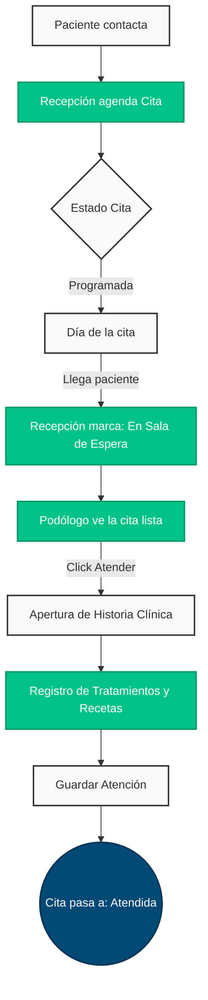
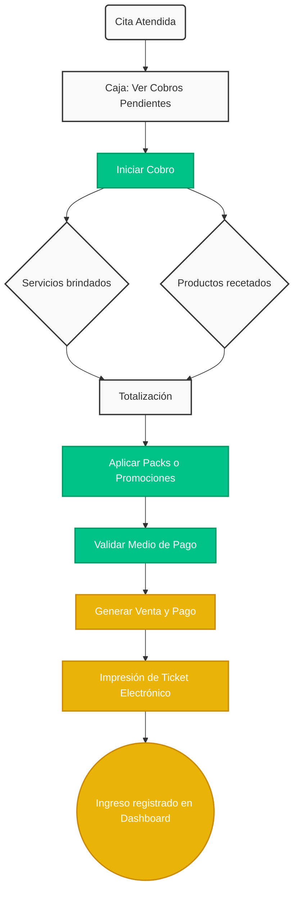
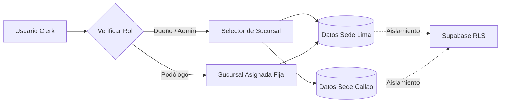

# 🦶 PodoFlow — SaaS Clinical Management System

[](https://react.dev/)
[](https://clerk.com/)
[](https://supabase.com/)
[](https://tailwindcss.com/)
[](https://github.com/pmndrs/zustand)

**PodoFlow** es una plataforma SaaS integral diseñada para redes de centros podológicos. Permite gestionar múltiples sedes, centralizar la información de pacientes y especialistas, registrar la evolución clínica y automatizar la gestión de caja y facturación.

> **Estado actual:** SaaS Multi-sucursales operativo con flujos completos de agenda, clínica, ventas, caja y reportes.

---

## 📑 Tabla de Contenidos
- [Flujos Principales de Negocio](#-flujos-principales-de-negocio)
  - [1. Flujo de Atención Clínica](#1-flujo-de-atención-clínica)
  - [2. Flujo de Caja y Cobros](#2-flujo-de-caja-y-cobros)
  - [3. Arquitectura Multi-Sucursal](#3-arquitectura-multi-sucursal)
- [Arquitectura y Stack Tecnológico](#-arquitectura-y-stack-tecnológico)
- [Instalación y Configuración](#-instalación-y-configuración)
- [Estructura del Proyecto](#-estructura-del-proyecto)
- [Documentación Técnica](#-documentación-técnica)

---

## 🔄 Flujos Principales de Negocio

El sistema está orientado a procesos para asegurar una experiencia sin fricciones entre la recepción, los podólogos y la administración.

### 1. Flujo de Atención Clínica

Controla el ciclo de vida de un paciente desde que reserva un turno hasta que el especialista registra su historia clínica.



**Puntos clave:**
- **Inmutabilidad:** El estado "Atendida" no se puede marcar a mano; solo se activa si el especialista llena el formulario clínico.
- **Doble reserva:** Previene asignar dos pacientes al mismo especialista en la misma franja.

### 2. Flujo de Caja y Cobros

Conecta automáticamente las atenciones clínicas con el módulo de pagos, permitiendo agrupar servicios, productos recetados y packs promocionales.



**Puntos clave:**
- **Extracción Automática:** La caja sabe exactamente qué cobrar leyendo los tratamientos y recetas de la historia clínica recién guardada.
- **Desglose de Packs:** Si un paciente compra un pack de sesiones, el ticket detalla cada servicio incluido con precio S/0.00 como constancia.

### 3. Arquitectura Multi-Sucursal

Garantiza el aislamiento de la información y la gestión de permisos a nivel empresarial (RBAC).



---

## 🏗 Arquitectura y Stack Tecnológico

La aplicación es una Single Page Application (SPA) construida sobre las tecnologías más modernas del ecosistema de React.

* **Frontend Framework:** React 19 + Vite (Rápido HMR y build optimizado)
* **Estilos & UI:** Tailwind CSS v3 + Lucide React (Íconos)
* **Gestión de Estado:** Zustand (Estado global de sucursal activa y UI) + React Hook Form (Manejo de formularios)
* **Validación:** Zod (Validación de esquemas y tipado estricto)
* **Base de Datos & Backend:** Supabase (PostgreSQL, Row-Level Security)
* **Autenticación:** Clerk (B2B SaaS auth con soporte para roles y organizaciones)
* **Gráficas y Exportación:** Recharts, html2canvas, SheetJS (Exportaciones Excel)

---

## 🚀 Instalación y Configuración

### 1. Clonar e Instalar
```bash
git clone https://github.com/tu-usuario/PodoFlow.git
cd PodoFlow
npm install
```

### 2. Variables de Entorno
Crea un archivo `.env.local` en la raíz del proyecto (nunca lo subas a GitHub):

```env
# Clerk Auth
VITE_CLERK_PUBLISHABLE_KEY=pk_test_...

# Supabase Database
VITE_SUPABASE_URL=https://tu-proyecto.supabase.co
VITE_SUPABASE_ANON_KEY=eyJ...
```

### 3. Entorno Local
```bash
npm run dev
```

---

## 📂 Estructura del Proyecto

El código está organizado por *features* (módulos) para que sea fácil escalar:

```text
src/
├── components/          # UI Components reusables (Botones, DatePickers, Modales)
├── config/              # Constantes globales (Ej. Configuración de Paginación)
├── hooks/               # Custom React hooks transversales
├── lib/                 # Inicialización de clientes 3rd party (Supabase, Utils)
├── pages/               # Vistas principales divididas por módulo de negocio:
│   ├── agenda/          # Flujo de Citas (Calendario, filtros, drag&drop)
│   ├── caja/            # Flujo Financiero (Puntos de venta, reportes, caja registradora)
│   ├── pacientes/       # Flujo Clínico (Fichas, historia médica, evoluciones)
│   ├── configuracion/   # Administración (Servicios, Promociones, Packs)
│   ├── especialistas/   # Directorio RRHH
│   └── Dashboard.tsx    # Analíticas y KPIs
├── stores/              # Zustand stores (Ej. branchStore para Multi-sede)
└── types/               # Tipos TypeScript y entidades de la Base de Datos
```

---

## 📖 Documentación Técnica

Para información profunda sobre la estructura de la base de datos (PostgreSQL), relaciones entre tablas, políticas de seguridad (RLS), convenciones de código y jerarquías CSS (Z-index), consulta el archivo de detalles técnicos:

👉 **[Ver Documentación Técnica y Base de Datos (TECHNICAL_DETAILS.md)](./TECHNICAL_DETAILS.md)**

---

## 🤝 Guía de Contribución

1. Haz fork del repositorio
2. Crea una rama para tu feature: `git checkout -b feature/nombre-feature`
3. Realiza tus cambios. Usa convenciones de commits (`feat:`, `fix:`, `refactor:`).
4. Haz push a tu rama: `git push origin feature/nombre-feature`
5. Abre un Pull Request describiendo el flujo de negocio que estás afectando.

---

## 📄 Licencia

Este proyecto está bajo la **Licencia MIT**. Consulta el archivo [LICENSE](LICENSE) para más detalles.
